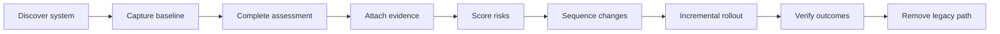

# Backend Modernization Checklist

A practical, evidence-based assessment toolkit for modernizing Java and Spring Boot systems without turning a framework upgrade into an uncontrolled rewrite.

It converts 40 checks across ownership, runtime, architecture, data, reliability, security, testing, observability, delivery, and operations into a weighted decision and prioritized action list.

## What You Get

- A version-neutral Java/Spring Boot modernization checklist
- Evidence requirements for every control
- Weighted scoring with explicit critical blockers
- A repeatable `READY`, `CONDITIONAL`, or `BLOCKED` decision
- A sample legacy-service assessment and generated report
- Discovery, ADR, rollout, and migration-strategy templates
- A standard-library Python CLI with automated tests and CI

## Start in 60 Seconds

Create a conservative worksheet where every item starts as `fail` and `Not assessed`:

```bash
python3 scripts/new_assessment.py --output assessment-my-service.csv
```

Replace each status with `pass`, `partial`, `fail`, or `na`, and attach concrete evidence. Then score it:

```bash
python3 scripts/score_assessment.py \
  --assessment assessment-my-service.csv \
  --output report-my-service.md
```

Run the included example and tests:

```bash
make check
```

The generated [sample report](examples/SAMPLE_REPORT.md) shows the expected output for an incomplete legacy-service modernization.

## Decision Rules

| Decision | Rule |
| --- | --- |
| `READY` | Weighted score is at least 85% and no critical check failed |
| `CONDITIONAL` | Weighted score is 65-84.9% and no critical check failed |
| `BLOCKED` | Score is below 65% or any critical check failed |

Priority weights are `critical = 5`, `high = 3`, and `medium = 1`. Status values score as `pass = 100%`, `partial = 50%`, `fail = 0%`, while `na` is excluded from the denominator.

A high score cannot hide a failed critical control. A check only passes when its evidence is reviewable; expectations and verbal confirmation are not evidence.

## Assessment Workflow



Use the [modernization playbook](docs/modernization-playbook.md) for phase gates, the [Java/Spring Boot guide](docs/java-spring-boot-guide.md) for upgrade risk areas, and [migration strategies](docs/migration-strategies.md) before deciding to rewrite or extract a service.

## Evidence Examples

| Claim | Acceptable evidence |
| --- | --- |
| Query is faster | Representative parameters, execution plans, equal business results, before/after measurements |
| Rollback is safe | Timestamped rehearsal with recovery time and data reconciliation |
| API is compatible | Old/new producer-consumer contract results |
| Retry is safe | Failure-injection result, bounded policy, and idempotency proof |
| Service is observable | SLI definition, dashboard, alert route, and incident owner |

## CLI Options

Emit JSON for automation:

```bash
python3 scripts/score_assessment.py \
  --assessment assessment-my-service.csv \
  --format json
```

Fail a pipeline when modernization is blocked:

```bash
python3 scripts/score_assessment.py \
  --assessment assessment-my-service.csv \
  --fail-on-blocked
```

## Repository Structure

```text
checklist/catalog.csv             Versioned controls and evidence requirements
scripts/                          Worksheet generator and scoring CLI
examples/                         Sanitized assessment and generated reports
docs/                             Playbook and Java/Spring Boot guidance
templates/                        Discovery, ADR, and rollout templates
tests/                            Scoring and validation tests
```

## Use in Real Projects

Treat the score as a decision aid, not a substitute for engineering judgment. Tailor controls only through a reviewed change, record why an item is `na`, and keep evidence close to the assessment. Re-score at agreed gates so risk reduction is visible rather than inferred from completed tickets.

## License

[MIT](LICENSE)
